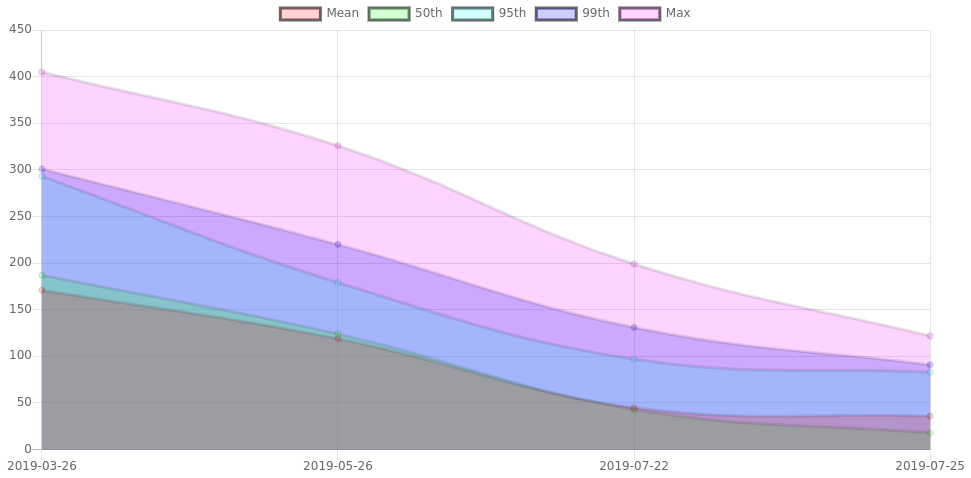

# Hazana-report-visualizer

This project allow you to generate graphs from hazana (https://github.com/emicklei/hazana) loadtest reports.

## How to use

download sources and run `go run *.go loadtest-reports/` assuming you've placed (only) report output files in the directory loadtest-reports.

You can also download a release for your platform under releases: https://github.com/robertalpha/hazana-report-visualizer/releases

run command examples:
- `hazana-report-visualizer [hazana-report-dir] [outputfile]`
  - hazana-report-dir: directory containing hazana loadtest output files, or string matching files `reports/*.log` or `reports/*.txt`
  - outputfile: optional, path+name of the html generated report defaults to `./report.html`
  
## Disclaimer
This software is provided as-is, and there are no guarantees that it fits your purposes or that it is bug-free. Use it at your own risk!